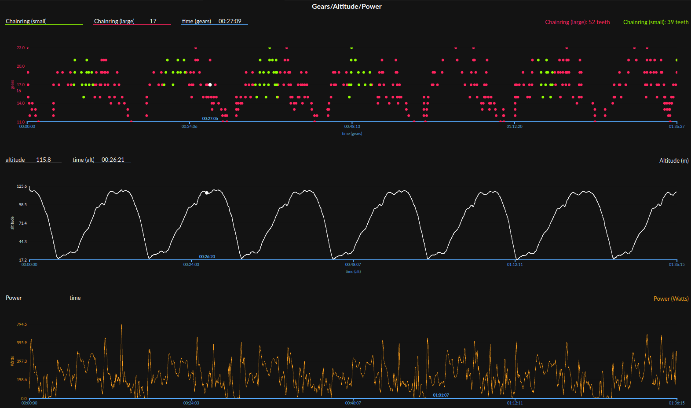

# Goldencheetah ShimanoDI2 charts

## Gear

Gear used during the ride, large chainring (red) and small (green)

- Needs GEARS Data in XDATA imported from fit file provided by ShimanoDI2 (or compatible)

Series for this chart are chainring_large.r and chainring_small.r.
You need to use the same X Unit for both to be plot on the same chart.

## Altitude

altitude.r

## Smoothed power

power.r

## GC gchart file

File Gears_Altitude_Power.gchart is used to import this chart into goldencheetah.

## Preview

