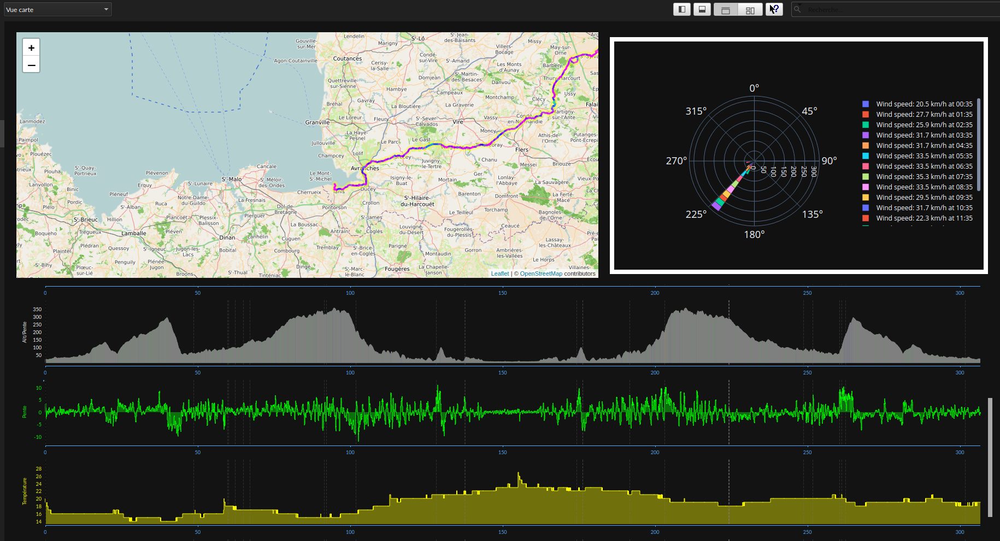

# Goldencheetah Wind speed and direction

## Wind

Python chart for goldencheetah showing wind speed and direction.

- Needs WEATHER Data in XDATA

See example [here](https://github.com/GoldenCheetah/GoldenCheetah/wiki/UG_Special-Topics_Custom-Data-Processors-in-Python#examples) to creates a WEATHER XData series with TEMPERATURE, WINDSPEED etc

## Preview

